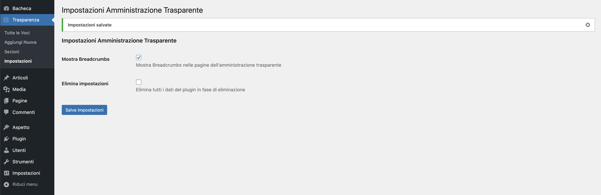
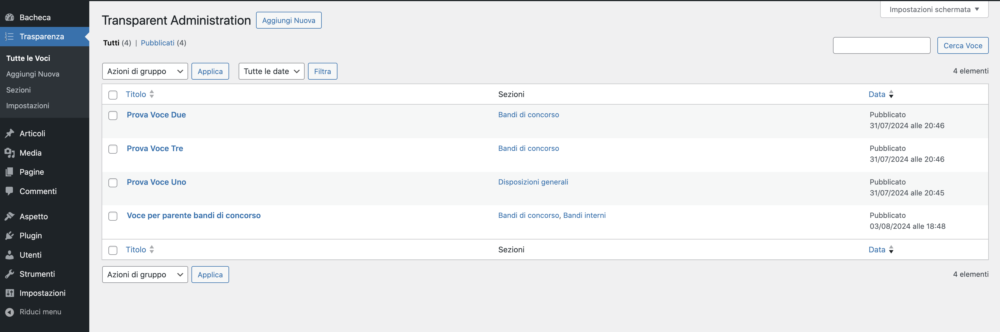
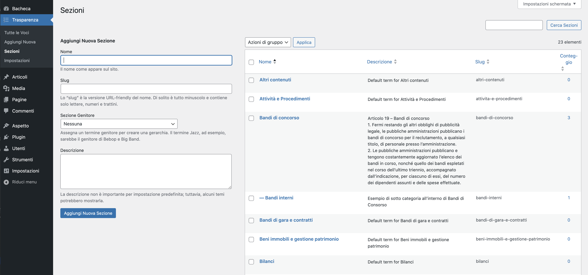
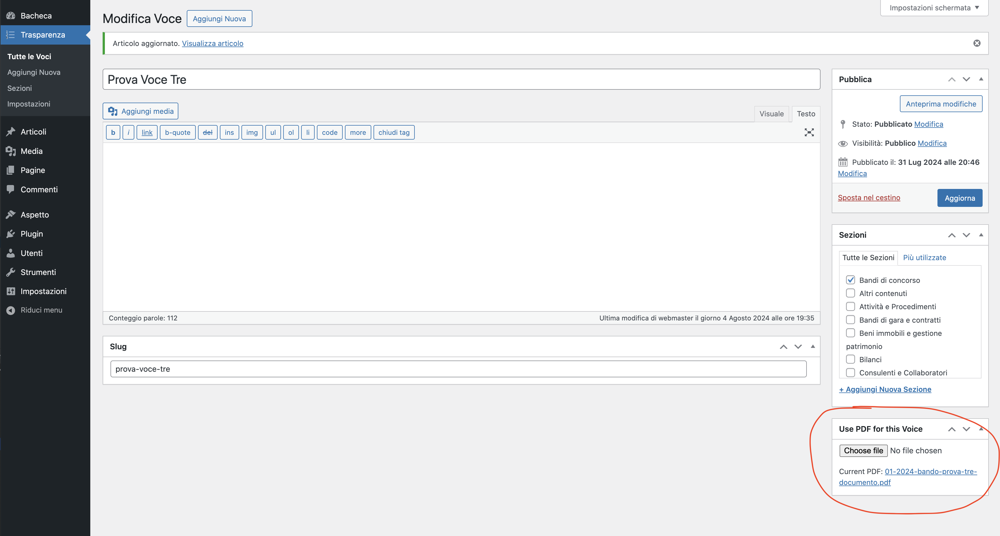
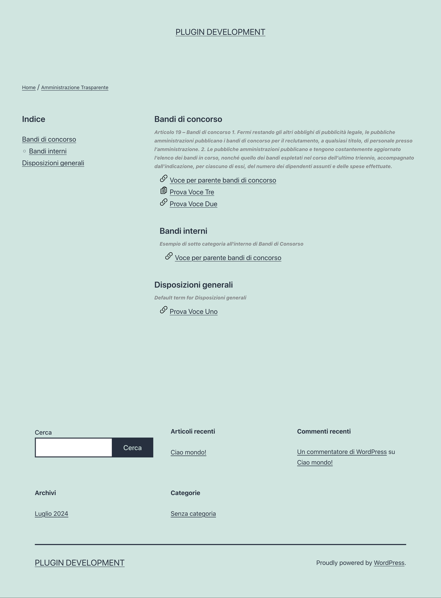

# Amministrazione Trasparente (Wordpress Plugin)

Plugin [Wordpress](https://github.com/WordPress/WordPress) per la gestione semplice dell'Amministrazione Trasparente

**Questo plugin semplifica la gestione della sezione Amministrazione Trasparente del tuo sito WordPress. Ti permette di creare e aggiornare facilmente i contenuti obbligatori per legge, assicurando la conformità al D.Lgs. 14 marzo 2013, n. 33.**

### Cos'è l'Amministrazione Trasparente?

L'amministrazione trasparente è una sezione obbligatoria per legge sui siti web delle pubbliche amministrazioni italiane. In questa sezione devono essere pubblicate tutte le informazioni sulle attività dell'amministrazione. I contenuti e la struttura della sezione sono regolati dal Decreto Legislativo 14 marzo 2013, n. 33.

### Funzionalità principali

* Creazione di sezioni e voci: Crea facilmente sezioni e relative sotto-sezioni per organizzare i tuoi contenuti.
* Gestione allegati PDF: Puoi allegare il documento PDF alla voce, senza la generazione di una pagina singola per la voce stessa.
* Personalizzazione: Imposta le tue preferenze all'interno del pannello di amministrazione di WordPress.

### Installazione
1. **Scaricare il plugin:** Clona o scarica il repository del plugin tramite Git.
2. **Posizionamento nella cartella plugin di WordPress:** Sposta le cartelle del plugin nella directory wp-content/plugins del tuo progetto WordPress.
3. **Attivazione del plugin:** Vai su Plugin nella tua bacheca di amministrazione WordPress e attiva il plugin "Amministrazione Trasparente".

### Utilizzo
* **Creazione delle sezioni:** Crea le sezioni principali e le relative sotto-sezioni per raggruppare i tuoi contenuti.
* **Creazione delle voci:** Aggiungi le singole voci informative all'interno delle sezioni create.
* **Permalink:** Rigenera i permalink e di default l'archivio dell'amministrazione trasparente è /transparent-administration

### Licenza
Questo plugin è distribuito sotto i termini della licenza GPLv2 o successiva (GPL). Puoi trovare maggiori dettagli sulla [LICENSE](http://www.gnu.org/licenses/gpl-2.0.html).

### Note aggiuntive
Le schermate seguenti mostrano alcune delle funzionalità del plugin:

* Impostazioni del plugin (facoltativo)
* Gestione delle voci dell'Amministrazione Trasparente
* Creazione di sezioni e sotto-sezioni
* Allega un PDF a una voce
* Impostazione dello slug personalizzato (opzionale)

**NOTA:**

I documenti allegati al plugin vengono salvati all'interno della cartella upload/mela-trans-admin, separatamente dai media di WordPress dedicati a foto e risorse.

**Screenshots:**

Le schermate mostrate nelle note aggiuntive sono state rinominate utilizzando numeri per una migliore organizzazione nel file README.md

